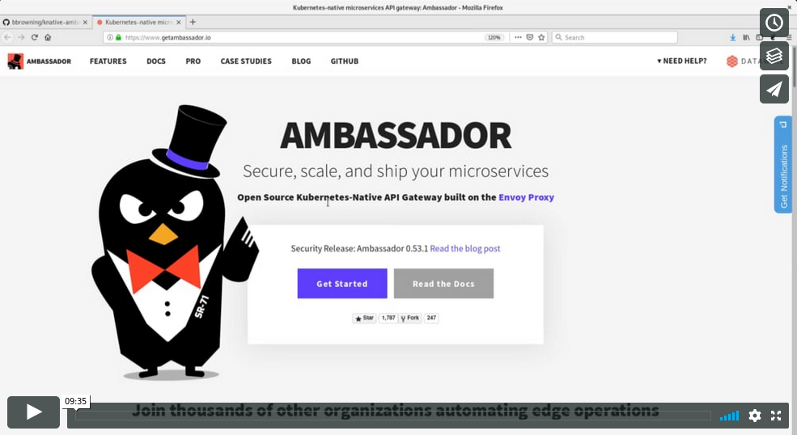

# Knative Ambassador Ingress

An [Ambassador](https://getambassador.io) ingress implementation for
Knative Serving.

This is an early prototype as a way to explore alternative ingress
implementations for Knative to provide lightweight non-Istio options
for users that don't want or need Istio.

Work is in-progress to switch Knative Eventing from a hard dependency
on Istio to the same ingress abstraction Serving uses. Once
[knative/eventing#294](https://github.com/knative/eventing/issues/294)
and
[knative/eventing#918](https://github.com/knative/eventing/issues/918)
are fixed then Ambassador will also work with Eventing.

# Demo
<a href="https://vimeo.com/329475364"></a>

# Installation

The instructions below were tested against Knative Serving v0.5.0 and
minikube running Kubernetes v1.12.0.

## Create a Kubernetes cluster

Follow the Knative Installation instructions to [create a Kubernetes
cluster](https://www.knative.dev/docs/install/). DO NOT install Istio
or Knative into that cluster yet.

If you want to use minikube, you can start a cluster with:

```shell
minikube start --memory=8192 --cpus=4 \
  --kubernetes-version=v1.12.0 \
  --vm-driver=kvm2 \
  --disk-size=30g \
  --extra-config=apiserver.enable-admission-plugins="LimitRanger,NamespaceExists,NamespaceLifecycle,ResourceQuota,ServiceAccount,DefaultStorageClass,MutatingAdmissionWebhook"
```

## Install Ambassador

```shell
kubectl apply --filename https://github.com/bbrowning/knative-ambassador-ingress/releases/download/v0.0.2/ambassador.yaml
```


## Install Istio CRDs

While we don't need Istio when using Knative Serving with Ambassador,
for now Knative Serving always bundles the Istio-based ClusterIngress
implementation and thus we need the Istio CRDs to be present even
though we won't install Istio itself.

```shell
kubectl apply --filename https://github.com/knative/serving/releases/download/v0.5.0/istio-crds.yaml
```

## Install Knative Serving

```shell
kubectl apply --filename https://github.com/knative/serving/releases/download/v0.5.0/serving.yaml
```

## Change the default ClusterIngress class

By default Istio is used for all ingress traffic. Switch that default
to our Ambassador implementation.

```shell
kubectl patch configmap -n knative-serving config-network -p '{"data": {"clusteringress.class": "ambassador.ingress.networking.knative.dev"}}'
```

## Optional - configure a real domain

If you don't like using Host headers in all your Knative demos,
configure a real domain following the steps at
https://www.knative.dev/docs/serving/using-a-custom-domain/ .

Or, if using minikube, something like below:

```shell
# Set the domain to one that resolves to minikube's IP
kubectl patch configmap -n knative-serving config-domain -p "{\"data\": {\"$(minikube ip).nip.io\": \"\"}}"

# Enable the ingress addon
minikube addons enable ingress

# Send all traffic to Ambassador via K8s Ingress
cat <<EOF | kubectl apply -f -
apiVersion: extensions/v1beta1
kind: Ingress
metadata:
  name: ambassador-ingress
  namespace: ambassador
spec:
  backend:
    serviceName: ambassador
    servicePort: 80
EOF
```

## Run the Ambassador Ingress

```shell
kubectl apply --filename https://github.com/bbrowning/knative-ambassador-ingress/releases/download/v0.0.2/release.yaml
```

## Deploy the Knative helloworld-go sample

```shell
cat <<EOF | kubectl apply -f -
apiVersion: serving.knative.dev/v1alpha1
kind: Service
metadata:
  name: helloworld-go
  namespace: default
spec:
  runLatest:
    configuration:
      revisionTemplate:
        spec:
          container:
            image: gcr.io/knative-samples/helloworld-go
            env:
              - name: TARGET
                value: "Go Sample v1"
EOF
```

Wait for the helloworld-go Knative Service to become Ready:
```shell
kubectl get ksvc helloworld-go -n default
```

Curl the sample app - example with minikube
```shell
curl http://helloworld-go.default.$(minikube ip).nip.io
```

## Test traffic splitting

Create a new Revision 
```shell
cat <<EOF | kubectl apply -f -
apiVersion: serving.knative.dev/v1alpha1
kind: Service
metadata:
  name: helloworld-go
  namespace: default
spec:
  runLatest:
    configuration:
      revisionTemplate:
        spec:
          container:
            image: gcr.io/knative-samples/helloworld-go
            env:
              - name: TARGET
                value: "Go Sample v2"
EOF
```

Curl the new revision
```shell
curl http://helloworld-go.default.$(minikube ip).nip.io
```

Split traffic between the two revisions
```shell
# Find our two revision ids
REVS=$(kubectl -n default get rev -l serving.knative.dev/service=helloworld-go --sort-by="{.metadata.creationTimestamp}" --no-headers -o custom-columns="name:{.metadata.name}") && echo "Revisions: $REVS"
FIRST_REV=$(echo $REVS | awk '{print $1}') && echo "First Revision: $FIRST_REV"
SECOND_REV=$(echo $REVS | awk '{print $2}') && echo "Second Revision: $SECOND_REV"

# Split traffic 50/50 between both revisions
cat <<EOF | kubectl apply -f -
apiVersion: serving.knative.dev/v1alpha1
kind: Service
metadata:
  name: helloworld-go
  namespace: default
spec:
  release:
    revisions:
    - $FIRST_REV
    - $SECOND_REV
    rolloutPercent: 50
    configuration:
      revisionTemplate:
        spec:
          container:
            image: gcr.io/knative-samples/helloworld-go
            env:
              - name: TARGET
                value: "Go Sample v2"
EOF

# curl the current revision, confirming it shows v1
curl http://current.helloworld-go.default.$(minikube ip).nip.io

# curl the candidate revision, confirming it shows v2
curl http://candidate.helloworld-go.default.$(minikube ip).nip.io

# curl multiple times, observing the traffic split
# approximately half should show v1 vs v2
# CTRL+C to exit the while loop
while true; do curl http://helloworld-go.default.$(minikube ip).nip.io; done
```

# Testing changes locally

If you want to hack on this Ambassador ingress implementation, clone
the repo and run the controller locally:

```shell
AMBASSADOR_NAMESPACE="ambassador" WATCH_NAMESPACE="" go run cmd/manager/main.go
```

# Building, pushing, and testing changes

This is how I do it, at least. You'll need to change the repos to ones
that aren't bbrowning.

```shell
operator-sdk build quay.io/bbrowning/knative-ambassador-ingress:v0.0.2
docker push quay.io/bbrowning/knative-ambassador-ingress:v0.0.2
```

Update the image in deploy/release.yaml and tag the git repo with the
same version as the image.
